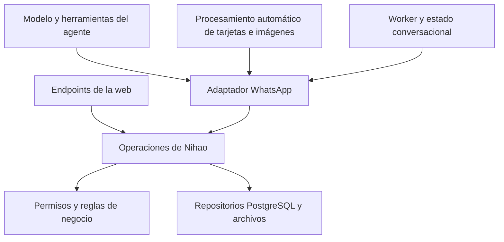

# Plan de separación entre agente y operaciones de Nihao

Fecha: 8 de octubre de 2026.

Estado: **PROPUESTO — documento de referencia, sin implementación**.

Estado actual: **IMPLEMENTACIÓN INTERNA DEL ALCANCE COMPLETADA LOCALMENTE; UAT Y PUBLICACIÓN PENDIENTES**. Ver [cierre e inventario final](../development/nihao-operations-local-completion-20261008.md). El estado PROPUESTO y los entregables siguientes corresponden a la referencia inicial, no al avance actual.

Actualización de seguimiento: la implementación fue autorizada después de redactar este plan y está en curso. El texto siguiente conserva la propuesta inicial; consultar los avances en [creación de productos](../development/nihao-operations-first-slice-20261008.md), [actualización de productos](../development/nihao-operations-product-updates-20261008.md), [archivos](../development/nihao-operations-product-files-20261008.md), [proveedores](../development/nihao-operations-suppliers-20261008.md) y [corrección y confirmación manual de capturas](../development/nihao-operations-capture-review-20261008.md). Por instrucción posterior del usuario, las evals de IA se excluyen de la ejecución de este plan. La validación determinística y los límites de UAT se documentan por etapa.

## Objetivo y decisión propuesta

Crear una capa de operaciones de negocio compartida por la web y el agente de WhatsApp. Esta capa será responsable de autorizar, validar, consultar y modificar proveedores, capturas, productos, notas y asociaciones de archivos. El agente interpreta pedidos y solicita operaciones; el canal administra conversaciones y entrega respuestas.

Comenzar como módulos internos del proyecto TypeScript actual. No crear un servidor separado ni llamadas HTTP internas en esta primera etapa. Una API independiente será una evolución opcional si aparece una necesidad concreta de despliegue independiente u otros consumidores.

El cambio es de arquitectura: preservar comportamiento, permisos y contratos externos. No adoptar LangGraph/LangChain, cambiar de modelo ni rediseñar la experiencia de carga como parte de este trabajo.

## Alcance de esta planificación

Este documento define etapas, contratos conceptuales, criterios de aceptación, riesgos y transición. No autoriza implementar, ejecutar migraciones, modificar registros, desplegar ni publicar cambios. Los nombres de módulos y operaciones son propuestas, no funcionalidades existentes.

La inspección se hizo sobre el workspace del 8 de octubre, que contiene cambios locales previos en el agente y los servicios de negocio. No se certificó que ese estado coincida con producción. Al iniciar la implementación debe fijarse un commit de referencia y separar los cambios locales existentes de esta refactorización.

## Punto de partida observado

| Pieza actual | Responsabilidad observada | Tratamiento propuesto |
| --- | --- | --- |
| `lib/channels/whatsapp/agent-orchestrator.ts` | Ciclo modelo/herramientas, límites y checkpoints | Conservar en el agente. |
| `lib/channels/whatsapp/agent-tools.ts` | Contratos de tools, preparación de evidencia, contexto y llamadas al dominio | Convertir gradualmente en adaptador de operaciones. |
| `lib/channels/whatsapp/prisma-agent-domain.ts` | Mezcla consultas, permisos, escrituras, recibos, propuestas y estado del canal | Extraer negocio; conservar un adaptador de compatibilidad para el runtime WhatsApp. |
| `lib/channels/whatsapp/agent-service.ts` | Ingesta, rutas automáticas de imágenes y coordinación del procesamiento | Conservar coordinación; todas las rutas de escritura deben pasar por las operaciones compartidas. |
| `app/api/bot/captures/[captureId]/products/route.ts` | Autoriza, parsea y crea productos directamente con Prisma | Delegar el caso de uso a la capa común. |
| `app/api/bot/captures/[captureId]/products/[productId]/route.ts` | Actualiza/elimina productos, con reglas propias del endpoint | Delegar sin ampliar permisos ni perder restricciones. |
| `app/api/bot/suppliers/[supplierId]/route.ts` | Consulta, modifica y elimina proveedores | Reutilizar servicios existentes y migrar el caso de uso. |
| `lib/bot/record-updates.ts`, `supplier-edit.ts`, `notes.ts` | Reglas parcialmente compartidas | Reutilizar y extraer; evitar implementaciones paralelas. |
| `lib/bot/record-completeness.ts` | Reglas de completitud y conservación de confirmados | Mantener como fuente de reglas, caracterizando las diferencias por flujo. |
| `lib/bot/persistence/supplier-confirmation.ts` | Promoción de capturas a proveedores | Incorporar al caso de uso común preservando asociaciones. |

Ya hay separación mediante `AgentDomain` y servicios internos. Se busca profundizarla, no reemplazar el sistema completo.

## Arquitectura objetivo



Dependencia permitida: canal/web → operaciones → reglas y repositorios. Las operaciones no importan `BurstSnapshot`, `AgentState`, contratos del modelo, Evolution ni prompts. El dominio no necesita saber cómo se redacta un mensaje de WhatsApp.

Estructura inicial sugerida:

```text
lib/nihao/operations/      # Casos de uso y contratos de entrada/salida
lib/nihao/domain/          # Políticas comunes, reutilizando lib/bot
lib/nihao/persistence/     # Adaptadores Prisma y unidad transaccional
lib/channels/whatsapp/     # Conversación, evidencias y adaptador del agente
app/api/bot/              # Autenticación HTTP, DTO y delegación
```

No mover todos los archivos por estética. Extraer por caso de uso y conservar imports compatibles mientras dure la transición. Un repositorio puede usar Prisma: la separación necesaria es respecto del canal y el modelo, no una abstracción genérica de cada consulta SQL.

## Distribución de responsabilidades

### Agente y procesamiento de evidencias

- Interpretar intención y extraer datos de texto, OCR, audio e imágenes.
- Resolver referencias conversacionales, incluido el proveedor anterior según cronología.
- Proponer el destino y adjuntar su procedencia verificable.
- Preparar evidencias y pedir aclaración cuando corresponda.
- Solicitar operaciones y formular respuestas basadas en resultados reales.

El agente no concede permisos ni decide arbitrariamente que una evidencia pertenece a un registro. Los datos comerciales deben seguir respaldados por texto/evidencias; una observación visual no prueba precio, disponibilidad ni plazo.

### Operaciones de Nihao

- Revalidar identidad, acceso al viaje, empresa, ownership y destino antes de cada lectura/escritura.
- Validar campos, notas y asociaciones a partir de evidencia autorizada cuando la fuente sea IA.
- Aplicar reglas de completitud, cambios parciales y promoción de capturas.
- Garantizar idempotencia y consistencia transaccional.
- Devolver IDs, estado efectivo, datos guardados, faltantes y resultado de la operación.

La web puede admitir edición humana que no exige una cita literal. No imponerle automáticamente las restricciones de extracción de IA. Toda excepción debe corresponder a una capacidad verificada en el servidor, no a un campo `source=WEB` enviado por el cliente.

### Runtime y canales

- Mantener agrupación, orden de mensajes, memoria y preguntas pendientes.
- Administrar locks, leases, revisión, checkpoints, propuestas conversacionales y outbox.
- Verificar envío de propuestas y registrar aprobación/cancelación explícita.
- Traducir errores del negocio a respuestas y códigos HTTP adecuados.

## Contratos conceptuales

### Contexto confiable

Cada operación recibe un contexto creado por el servidor: usuario autenticado, viaje, empresa cuando aplique, capacidades autorizadas y correlación de solicitud. Los IDs recibidos del modelo o navegador son referencias a validar, no autorización.

El adaptador WhatsApp agrega una identidad de operación estable y referencias a evidencias. El contexto técnico de lease/revisión pertenece al runtime; se verifica mediante una unidad de ejecución transaccional, sin exponer estructuras de WhatsApp al dominio.

### Primer catálogo de operaciones

| Operación propuesta | Entrada principal | Salida principal |
| --- | --- | --- |
| Buscar/obtener proveedores y productos | Filtros y referencias dentro del alcance autorizado | Registros y candidatos; coincidencias aproximadas no equivalen a selección. |
| Crear producto | Destino proveedor/captura, campos, notas y evidencias | Producto persistido, estado, asociaciones y campos guardados. |
| Actualizar producto | ID, patch explícito, versión esperada cuando corresponda | Resultado actualizado o necesidad de aprobación/conflicto. |
| Crear/completar captura de proveedor | Datos, contactos, notas y evidencias | Captura/proveedor y estado efectivo. |
| Confirmar captura | ID y condiciones vigentes de confirmación | Proveedor y productos vinculados. |
| Asociar/desasociar evidencia | IDs de archivo y destino | Relación verificada; ningún movimiento implícito. |
| Agregar/corregir notas | Destino, texto y modo permitido | Notas finales conforme a la política vigente. |
| Aplicar cambio autorizado | Propuesta vigente, versión y aprobación verificada | Cambio aplicado una vez o conflicto/expiración. |

Eliminar registros se incorporará sólo para consumidores que ya tienen esa capacidad. Compartir servicios no habilita eliminación ni traslados en el agente.

### Resultado y errores

Separar éxito persistido, rechazo de negocio y fallo reintentable. Ejemplos de códigos: `NOT_FOUND`, `INVALID_INPUT`, `AMBIGUOUS_TARGET`, `APPROVAL_REQUIRED`, `VERSION_CONFLICT`, `EVIDENCE_INVALID`, `IDEMPOTENCY_CONFLICT` y `TEMPORARY_FAILURE`. Ajustar nombres a errores existentes durante el inventario; no cambiar contratos externos de golpe.

No filtrar existencia ni datos de recursos ajenos. Conservar la semántica actual de denegación/no encontrado según endpoint. El adaptador traduce los códigos comunes a los contratos históricos de tools y HTTP.

Un recibo distingue entre registro escrito y operación completa: si falta enlazar un archivo, no responder que el producto con foto quedó íntegramente guardado. Las respuestas finales se forman a partir de resultados persistidos.

## Transacciones, archivos y recuperación

Este es el principal riesgo de la extracción. Actualmente varias escrituras y recibos se coordinan bajo revisión/lease de conversación. No separar la escritura del recibo con dos transacciones independientes.

Para PostgreSQL, proponer una unidad de ejecución que permita incluir en una misma transacción:

1. Verificación de autorización vigente y del fencing del runtime cuando aplique.
2. Reserva o recuperación del identificador de operación.
3. Escritura del negocio.
4. Registro del resultado/recibo y consumo de evidencias pendientes que corresponda.

El callback del runtime participa en esa unidad sin que el servicio de negocio importe tablas o tipos conversacionales. Definir el contrato exacto en la etapa 1 y demostrarlo con interrupciones antes de migrar escrituras.

Idempotencia: misma clave y mismo comando normalizado recuperan el resultado anterior; misma clave con contenido diferente da conflicto. Reintentar no debe crear productos, contactos ni archivos duplicados. Mantener los identificadores existentes o una traducción compatible para operaciones históricas; no recalcularlos con nuevas reglas sin una estrategia explícita.

R2 y PostgreSQL no comparten transacción. Preservar almacenamiento recuperable, enlaces idempotentes y estado pendiente para fallos parciales. No incluir llamadas al modelo, Evolution o transferencias de archivos dentro de transacciones largas. Si se requieren nuevas tablas/índices, presentar una migración aditiva separada; no asumir que es necesaria antes de evaluar recibos existentes.

## Etapas de implementación

### 0. Fijar referencia y caracterizar comportamiento

Entregables:

- Commit de referencia y lista de cambios locales/publicados.
- Inventario de lecturas/escrituras de web, tools, rutas automáticas de imágenes y procesadores legacy activos.
- Matriz de permisos y políticas por consumidor: creación, confirmación, edición humana y aprobación conversacional.
- Casos de carga del manual como escenarios de aceptación, con datos sintéticos.
- Lista de fallos preexistentes reproducidos, separada de regresiones nuevas.

Gate: conocer todos los caminos que crean o modifican productos y documentar qué comportamiento conservar. No sustituir reglas actuales por documentación histórica: el workspace inspeccionado confirma productos por nombre válido; hay documentos anteriores con mínimos distintos.

### 1. Definir contratos y unidad transaccional

Entregables:

- Contexto confiable, comandos normalizados, DTO de resultado y mapa de errores.
- Interfaz transaccional para mutación/recibo/fencing y reglas de idempotencia.
- Adaptador de compatibilidad para tools, endpoints y checkpoints históricos.
- Decisión documentada sobre reutilizar almacenamiento existente o necesitar migración aditiva.

Gate: prueba de escritura recuperable sin duplicación y sin dependencia del dominio respecto de tipos WhatsApp. Contratos revisables antes de extender la extracción.

### 2. Primera sección completa: crear producto

Extraer la creación de producto reutilizando parsers, completitud, permisos y repositorios actuales. Primero conectar el POST web; luego tools y rutas automáticas de imagen al mismo caso de uso.

Incluir: proveedor confirmado o captura incompleta, precio/moneda/MOQ/plazo opcionales según reglas vigentes, notas, imágenes y procedencia. La resolución de «proveedor anterior» permanece en conversación; el destino seleccionado se valida nuevamente en la operación.

Gate: web y WhatsApp utilizan la misma escritura y políticas comunes; ninguna ruta automática del alcance evita el servicio. Reintentos y cambios de revisión no producen duplicados ni asignaciones tardías.

### 3. Completar operaciones de producto

Migrar consulta, búsqueda, actualización, notas y asociación/desasociación de imágenes. Mantener edición web autorizada y propuesta/aprobación para cambios confirmados por WhatsApp como políticas distintas explícitas. Mantener restricciones de reanálisis y eliminación existentes.

Gate: cambios parciales conservan campos omitidos, notas no se borran implícitamente, un cambio sin aprobación conversacional válida no se aplica y conflictos de versión no sobrescriben datos.

### 4. Operaciones de proveedor y capturas

Migrar creación/completado, contactos, notas, consulta, edición y promoción. Incorporar reconciliación de tarjetas sin cambiar umbrales ni política de duplicados. Reutilizar confirmación y actualización existentes.

Gate: al promover una captura se conserva evidencia y se vinculan productos sin cambiar arbitrariamente su estado. Reenvíos, homónimos y conflictos mantienen su comportamiento caracterizado.

### 5. Cerrar dependencias y retirar duplicación

Convertir `PrismaAgentDomain` en adaptador de operaciones y persistencia de conversación. Eliminar escrituras de negocio duplicadas sólo cuando todos sus consumidores estén migrados. Mantener modelos de conversación y tablas operativas accesibles al runtime.

Gate: inspección de imports y búsquedas de escrituras comprueban que endpoints/tools/rutas automáticas del alcance delegan en la capa común. No hay una segunda política de creación o completitud mantenida en paralelo.

### 6. Validar y publicar por etapas

Entregables: resultados determinísticos, evals del modelo, UAT físico, evidencia del commit probado y procedimiento de rollback. Ejecutar gates del repositorio según el alcance: typecheck, lint, build, tests relevantes y Prisma cuando haya cambios de persistencia.

Desplegar primero al entorno de prueba siguiendo la política del proyecto. Producción requiere autorización explícita. Los cambios de documentación de comportamiento y ejemplos del manual sólo se publican cuando el recorrido exacto fue aceptado.

## Matriz mínima de validación

| Escenario | Comprobación requerida |
| --- | --- |
| Producto con proveedor explícito | Destino, empresa derivada, campos y notas correctos. |
| Producto sin proveedor explícito | Último proveedor válido anterior según orden original; referencia explícita prevalece. |
| Cambio de proveedor | No hereda notas, condiciones ni archivos del anterior. |
| Varias cargas juntas | Registros separados, condiciones propias y resultado por producto; éxito parcial descrito correctamente. |
| Foto de producto con/sin nombre | Imagen ligada al registro correcto; descripción visual no inventa condiciones comerciales. |
| Tarjeta con notas y condiciones | Destino y tratamiento actuales preservados, sin convertir la tarjeta en foto de producto. |
| Sin destino o destino ambiguo | Conservación/clarificación conforme al flujo vigente; no proveedor ficticio. |
| Captura incompleta y posterior promoción | Producto y evidencias conservados; vínculos correctos al confirmar proveedor. |
| Edición desde web y WhatsApp | Permisos y política de aprobación propios; patch conserva omitidos y borrado es explícito. |
| Reintento y reinicio | Una escritura, recuperación del resultado y archivos sin duplicados. |
| Mensaje nuevo durante operación | Fencing impide aplicar una revisión obsoleta. |
| Dos consumidores editando | Conflicto detectable sin pérdida silenciosa de actualizaciones. |
| Permiso revocado antes de ejecutar | Operación rechazada aunque se autorizó una lectura anterior. |
| Archivo o outbox fallido | Estado recuperable; respuesta no afirma una acción incompleta. |
| Checkpoint histórico | Retoma sin reinterpretar ni duplicar operaciones previas. |

Usar PostgreSQL aislado para pruebas transaccionales, datos sintéticos y transporte capturado. Evals con modelo real verifican interpretación y elección de herramientas; no sustituyen pruebas determinísticas de permisos/transacciones ni UAT físico de WhatsApp, cámara y audio. No ejecutar cargas en producción como parte de una prueba rutinaria.

## Observabilidad, transición y rollback

- Correlacionar solicitud, operación, conversación y recurso sin registrar secretos ni evidencia sensible en logs generales.
- Registrar duración, resultado, reintentos, conflictos de idempotencia y recuperación de operaciones incompletas.
- Migrar por caso de uso con un único dueño de escritura. No hacer dual-write.
- Si se usa una bandera para alternar adaptadores, fijar versión/ruta para operaciones ya iniciadas; un cambio de bandera no debe reinterpretar un checkpoint pendiente.
- Comparación en sombra permitida sólo para validaciones/lecturas sin efectos; nunca ejecutar una segunda escritura para comparar.
- Rollback al adaptador anterior sólo cuando los recibos y estados escritos siguen siendo compatibles. Mantener wrappers temporales y drenar operaciones nuevas si no lo son.
- Las migraciones, si fueran necesarias, serán aditivas y compatibles con la versión previa; no borrar tablas ni revertir datos guardados durante rollback.

## Criterios de finalización

1. Los consumidores migrados comparten operaciones y reglas de negocio; no escriben registros del alcance por fuera de ellas.
2. La capa común no importa tipos del canal ni del modelo y revalida autorización en cada operación.
3. Los contratos web/tools y checkpoints existentes mantienen compatibilidad verificada.
4. Las escrituras son recuperables e idempotentes, con pruebas de interrupción y fencing.
5. Los escenarios del manual y las políticas de notas, imágenes, confirmación y edición no presentan regresiones nuevas.
6. Los fallos preexistentes y límites de UAT se informan por separado; no se presentan como resueltos por esta refactorización.
7. Hay evidencia de validación del commit publicado y un procedimiento de rollback practicable.

## Evolución opcional: API independiente

Evaluar después de completar la separación interna, sólo si se necesita desplegar el agente por separado, soportar otro runtime o sumar consumidores externos. El agente actual y uno futuro en Python podrían utilizar los mismos casos de uso.

Antes de exponer HTTP definir autenticación de servicio con identidad delegada del usuario, permisos por operación, DTO versionados, idempotencia, concurrencia, timeouts, límites y errores. Nunca aceptar un `userId` arbitrario como identidad autenticada ni exponer Prisma/SQL al agente.

La separación por red rompe la transacción local entre negocio y recibo conversacional. La API debe guardar comando y resultado durable del lado de negocio y permitir recuperar por clave de idempotencia; el canal registra su checkpoint después y puede reconciliarlo tras un fallo. Este contrato debe resolverse y probarse antes de extraer el servidor. No llevar callbacks transaccionales internos a través de HTTP.

## Referencias

- [Arquitectura del agente WhatsApp](whatsapp-agent-tools.md).
- [Reglas de notas](supplier-product-notes.md).
- [Asociación de imágenes y comentarios, cambios locales del 8 de octubre](../development/whatsapp-image-association-20261008.md).
- [Evaluación del código publicado del 7 de octubre](../development/whatsapp-production-evals-20261007.md).
- [Estado operativo y UAT](../uat/mvp-uat-plan.md).

Este plan es referencia de implementación propuesta. Las reglas de producto vigentes deben caracterizarse con código y pruebas del commit seleccionado antes de comenzar.
