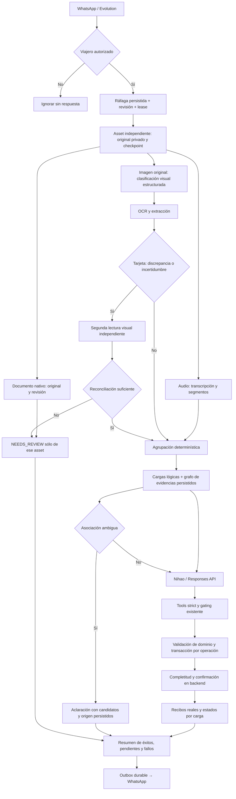

# WhatsApp v3: ingesta multimodal y agrupación de evidencias

Estado: segunda etapa implementada **localmente** el 6 de octubre de 2026. Sin push, despliegue ni migración de base de datos. Luna conserva Responses API, reasoning medium y ningún parámetro temperature. OCR, visión y transcripción conservan los proveedores/modelos existentes de Mistral.

## Arquitectura encontrada y puntos de fallo

El webhook Evolution valida al viajero y conserva mensajes originales en WhatsAppBurstMessage. El worker reclama una ráfaga con revisión y lease; BurstReader descarga los adjuntos a almacenamiento privado, obtiene OCR/transcripción/extracción y WhatsAppAgentOrchestrator decide llamadas a tools. PrismaAgentDomain revalida permisos y persiste cada operación por separado; el outbox publica el resumen real.

No había una transacción PostgreSQL que abarcara toda la batch. La interrupción global se producía en agent-service.ts: un único try contenía la lectura de todos los mensajes, por lo que una excepción de un adjunto evitaba ejecutar los demás. El presupuesto de rondas del agente también se compartía entre todas las tarjetas.

La entrada de agent-orchestrator.ts contenía mensajes individuales sin cargas lógicas persistidas; agrupación y asociación recaían en el modelo. agent-tools.ts verificaba citas y permisos, pero no la pertenencia a una carga. Esto permitía mezclar audio con otro proveedor y tratar frente/reverso como entidades distintas. BurstReader no distinguía DOCUMENT ni conservaba lados o una lectura estructurada contrastada de tarjetas. La verificación de imágenes de productos no exigía una relación IMAGE_OF auditable. Los archivos nativos documentMessage tampoco ingresaban al procesador v3 como documentos.

## Flujo

## Estructuras y persistencia

Se reutilizan columnas JSON existentes; no hay tablas nuevas ni SQL de migración:

- WhatsAppBurstMessage.reading.ingestion: estado, etapa, intentos con revisión, clasificación, legibilidad, lecturas independientes, candidato OCR, texto confiable, loadIds y error con tipo/etapa/retryable. OCR, transcripción, original y resultados parciales permanecen conservados.
- WhatsAppBurst.state.ingestion: EvidenceGraph versionado por revisión con assets, loads, links, derivations y summary. Guarda activeLoadId sólo durante procesamiento por tarjeta.
- LogicalLoad: identificador estable basado en burst + asset lógico, tipo SUPPLIER/PRODUCT/EVIDENCE, assets, nombre, estado, razones, pregunta pendiente, error, resourceId y ejecución (rondas/motivo/revisión).
- EvidenceLink: asset y opcionalmente segmento fuente, carga destino, relación, confianza categórica HIGH/MEDIUM/AMBIGUOUS, razones y candidatos. DERIVED_FROM conecta OCR/transcripción con su asset original.
- WhatsAppAgentOperation.result: recibos con logicalLoadIds y estado real del recurso. SupplierProduct.sourceEvidence conserva logicalLoadIds y pruebas de media junto con las citas existentes.

Estados de assets/cargas: RECEIVED, CLASSIFIED, PARSED, GROUPED, PROCESSED, NEEDS_REVIEW, FAILED. Un asset puede pertenecer a varias cargas cuando segmentos distintos de audio aportan hechos a productos diferentes. Los contadores processed/pending/needsReview/failed cuentan cargas lógicas; totalAssets cuenta originales. Cada error conserva su etapa y recuperabilidad. Los logs resumen batchId, assetId, candidatos, destino, razones, confianza y motivo de terminación, sin imprimir contenido completo de tarjetas o audios.

## Visión, lectura y validación

El análisis visual usa bytes de la imagen original y devuelve JSON cerrado validado en servidor: BUSINESS_CARD, PRODUCT, DOCUMENT u OTHER; FRONT/BACK/UNKNOWN_SIDE; confidence; readable/partially_readable/unreadable/ambiguous. El umbral inicial de aceptación es 0.85, no una probabilidad calibrada.

Las tarjetas extraen empresa, persona, cargo, teléfonos, emails, webs, dirección, texto visible, branding e incertidumbres. Emails/contactos y webs se validan; los teléfonos sólo se normalizan eliminando separadores sin inventar dígitos. Los datos inválidos se retiran y se marcan inciertos. El OCR se conserva y contrasta con visión para nombre y contactos/webs estructurados. Un contacto presente en OCR que no aparezca en visión también provoca discrepancia.

Una discrepancia material, baja confianza o incertidumbre habilita una segunda llamada sobre la imagen original. Esa llamada no recibe ni OCR ni la respuesta anterior como verdad. Se acepta sólo una segunda lectura suficientemente confiable reconciliada con los campos contrastables del OCR; si persiste la duda, queda NEEDS_REVIEW con ambas lecturas y el original. El servidor bloquea su uso para mutaciones hasta resolver la evidencia. No se promete leer cualquier imagen.

Productos extraen descripción visible, marca/modelo visibles, texto y packaging. La descripción ayuda a reconocer vaso/martillo y asociar audio. La visión no genera precio, FOB, MOQ, plazo, país ni condiciones de pago; los facts comerciales requieren texto/transcripción/evidencia explícita. Las imágenes de documentos se distinguen visualmente y el OCR permanece disponible como evidencia documental, sin confirmar productos.

## Agrupación de tarjetas

Primero se construyen cargas de imágenes. Un reverso puede incorporarse a un frente por identidad de empresa, dominio no genérico o contacto, con complementariedad de lados. Nombres de empresa distintos impiden agrupar aunque compartan branding. Branding u orden por sí solos no bastan; lados iguales conocidos no se agrupan. UNKNOWN_SIDE requiere identidad más fuerte y no se transforma arbitrariamente en FRONT_OF.

Una única coincidencia produce una carga SUPPLIER que contiene ambos assets y sus enlaces FRONT_OF/BACK_OF. Varias coincidencias conservan la carga independiente en revisión con POSSIBLY_RELATED y candidatos. Una aclaración numérica puede elegir el frente; la elección queda persistida para futuras reconstrucciones del grafo. Sin señales suficientes se mantienen cargas separadas. No hay deduplicación global ni agrupación automática de dos UNKNOWN_SIDE.

prepare_evidence incorpora las evidencias complementarias de una carga confiable. create_supplier_draft exige incluir ambos lados antes de escribir. Se combinan nombre y contactos con las validaciones existentes; el backend deriva confirmed por nombre + contacto válido. Añadir después un reverso a una carga ya persistida conserva su resourceId y exige completar ese recurso, evitando crear otro proveedor.

## Asociación de audios y textos

Las transcripciones se segmentan. Cada segmento se relaciona por referencia explícita a proveedor/alias único o producto reconocible mediante descripción visual, marca/modelo/texto visible. Una respuesta a una aclaración puede seleccionar exactamente la carga preguntada. Una referencia contextual como este producto sólo se acepta si hay un único candidato del tipo correspondiente. El anterior utiliza orden únicamente porque el usuario lo indicó expresamente; citar un asset conocido también aporta una referencia explícita.

No se asocia un audio comercial al último proveedor por mera proximidad, ni siquiera a un único proveedor sin alguna señal referencial. Si varias cargas coinciden o falta referencia suficiente, queda AMBIGUOUS_ASSOCIATION, POSSIBLY_RELATED sin target seleccionado y una aclaración con opciones persistidas. Las operaciones de las otras cargas pueden continuar.

Las validaciones se aplican al segmento citado, no al audio completo: un segmento sobre vaso y otro sobre martillo tienen enlaces separados. Una cita que abarque ambas cargas no autoriza una mutación sobre un único producto. La relación a un proveedor ya creado se compara con sus IDs reales para impedir escribir esos hechos en otro proveedor.

## Confirmación de productos

Se mantiene la función de completitud de la primera etapa. Antes de otorgar prueba de imagen válida se exige clasificación PRODUCT confiable, enlace IMAGE_OF explícito a una carga PRODUCT sin ambigüedad y media realmente persistida. FACTS externos deben pertenecer a esa misma carga. Nombre de un vaso con foto asociada a martillo no confirma. BUSINESS_CARD, DOCUMENT, OTHER, OCR y asociaciones ambiguas no aportan prueba de imagen. Un producto confirmado conserva su estado en actualizaciones comerciales.

## Éxitos parciales y retries

Cada asset se lee y checkpointa por separado. Fallos transitorios permiten hasta dos intentos acotados; errores determinísticos de validación/HTTP no recuperable pasan a revisión sin retry ciego. Se registra cada intento y se conserva el resultado parcial. Después de agotar intentos, reintentar explícito habilita otra ejecución sólo para fallos recuperables.

Cada carga de tarjeta tiene su propio loop con soft/hard limit y watchdog existentes. Una tarjeta fallida no bloquea otras tarjetas. Los productos y otras operaciones usan el loop existente después de las tarjetas; no se agrega create_product_draft_batch. La ventana de 220 segundos del worker conserva checkpoints y reanuda; no existe una promesa de terminar 20 tarjetas en una única invocación.

Las transacciones de dominio siguen siendo independientes y revalidan permisos. La idempotencia técnica existente de WhatsAppAgentOperation y la recuperación WRITTEN → COMPLETED siguen vigentes; no se deduplica por nombre. Si falla la copia de media tras escribir, esa operación permanece WRITTEN y su carga FAILED recuperable; las otras pueden continuar. No se declara confirmación hasta finalizar media y derivar completitud. El outbox informa totales y pendientes explícitos junto con los recibos reales.

## Compatibilidad y límites pendientes

La ingesta nueva se activa sólo en composición v3. v2 conserva su lector; documentos nativos se admiten en v3 sin trasladar batches v2 ya existentes. Se mantienen las 15 tools strict, autorización, propuestas y aprobación manual de modificaciones a recursos confirmados, memoria condicional de cinco conversaciones, modelo y reasoning.

Los documentos nativos se guardan privados dentro del límite de media existente (8 MB) y quedan DOCUMENT_FILE_REQUIRES_REVIEW: no se implementó extracción automática de PDF. Si no se pudo descargar un archivo o excede ese límite, su envelope/error permanece trazable, aunque no haya copia local del archivo. La lectura de otros campos de tarjeta no reconcilia automáticamente cada campo comercial con visión; resultados parciales del OCR permanecen auditables.

Las llamadas reales a visión/OCR/Luna requieren UAT con originales del cliente. Los tests simulan respuestas de proveedores y usan PostgreSQL local real. Agrupación conservadora por dominio/contacto/nombre y vocabulario visual puede pedir más aclaraciones con logos sin texto, sinónimos o referencias complejas. Una lectura en que ambos motores coincidan equivocadamente sigue siendo un riesgo; umbrales y señales deberán calibrarse con casos reales. La segunda lectura y loops por tarjeta aumentan coste/latencia; cada llamada tiene timeout, pero varias etapas de un asset pueden consumir gran parte de la ventana del worker. No se ha creado dashboard ni eval framework nuevo.
